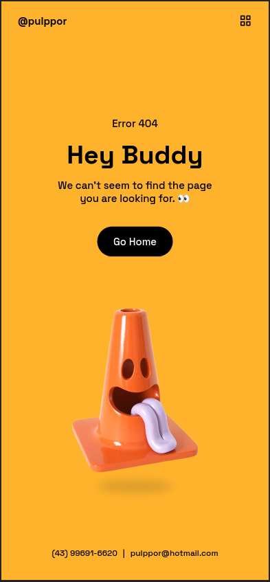

# Página Responsiva de Erro 404

Este projeto consiste na criação de uma página responsiva de erro 404 utilizando HTML, CSS, JavaScript, Sass e a biblioteca ScrollReveal. O design da página foi baseado em uma videoaula do canal do Bedimcode, utilizando a arte de David Seliger da empresa Core77.

## Recursos Utilizados

- HTML: Linguagem de marcação utilizada para estruturar a página.
- CSS: Linguagem de estilo utilizada para a aparência e o layout da página.
- JavaScript: Linguagem de programação utilizada para interatividade e comportamento dinâmico.
- Sass: Pré-processador CSS utilizado para facilitar a escrita e organização do código CSS.
- ScrollReveal: Biblioteca JavaScript utilizada para criar animações de revelação ao rolar a página.

## Como Executar o Projeto

1. Clone este repositório para o seu ambiente local.
2. Abra o arquivo `index.html` em um navegador web.
